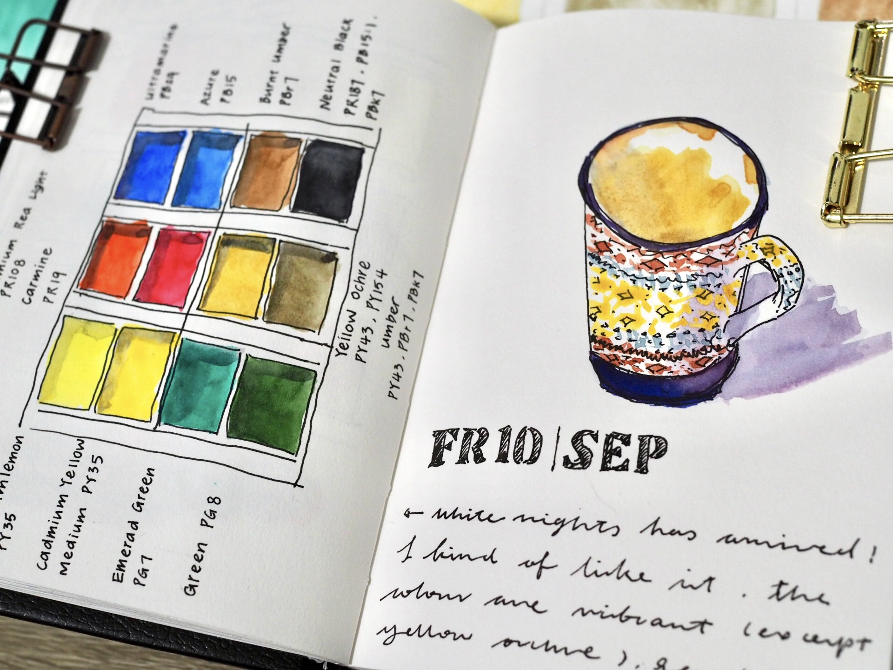
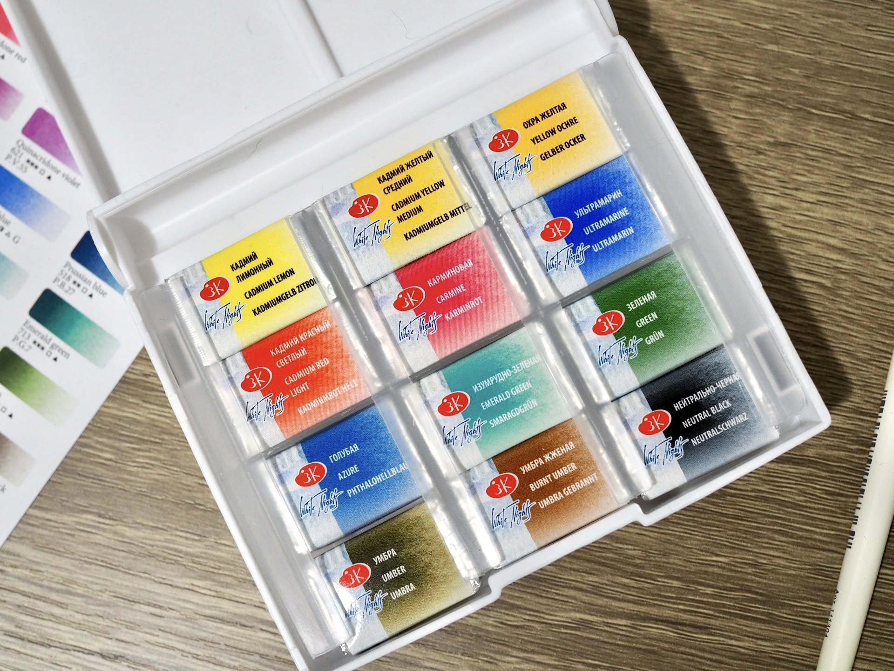
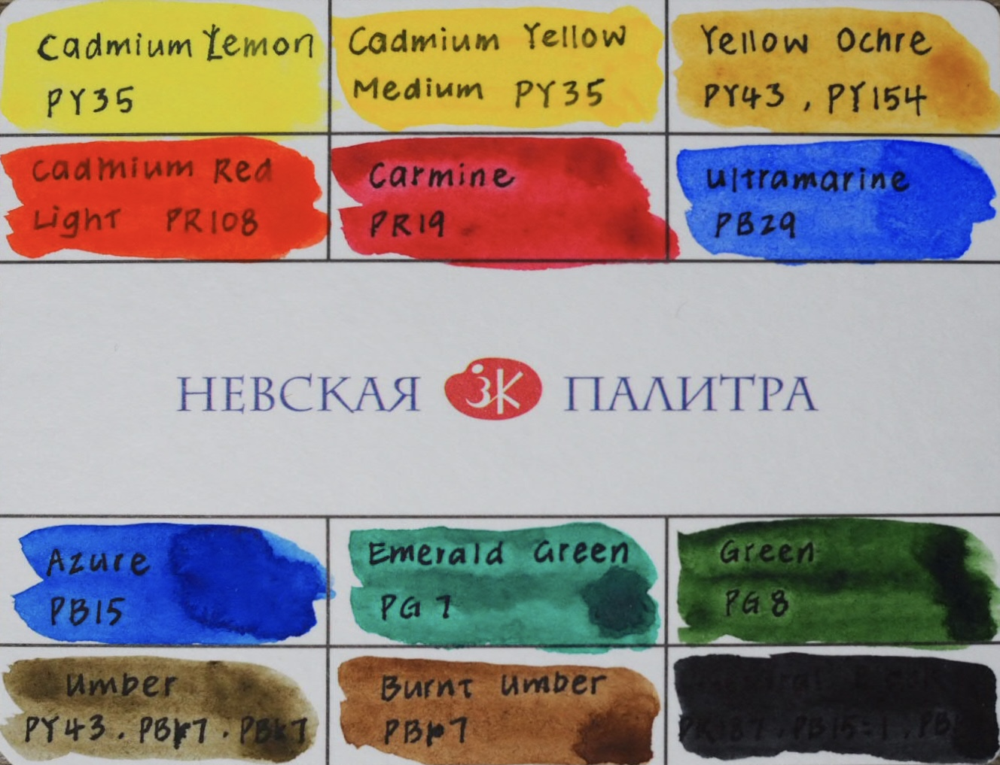

## The brand

White Nights is a brand from Russian manufacturer [Nevskaya Palitra](https://www.nevapalette.com). This 12 watercolour set is very popular because **it's really cheap** as artist grade paint. Reviews differ a lot for some reasons, so I decided to try it myself, and I found both pros & cons are quite obvious.

I also noticed few things that are not mentioned in other reviews which I will share it here.

**For TL;DR**: [Jump to conclusion](#conclusion)

## The Box and Pans

### The box

The box is made of plastic and the material feels a bit cheaper compared to Winsor & Newton or Sennelier. For some reasons, the box attracted cat hairs heavily.

There are **only two mixing wells**. It's a pity because the box size is actually larger than W&N Cotman Pocket Sketcher Set, which has three mixing wells. It has a place to store a pocket brush though.

### Pans size

 The box contains 12 full pans. **The pan size is not standard full pan**.

Here is a picture comparing with my generic full pan. The upper one is the generic one and below is `Cadmium Lemon (PY35)` from White Nights. The width is the same, but White Nights pan is 1~2 mm shorter.

The manufacturer did mention that **the pan size is 2.5ml** in their brochure, which is slightly smaller than a regular full pan capacity (appx. 3ml).

It's really not a big issue, because the box can still hold a generic pan. But it reflects another problem:

### Gaps in housing

**The pans are not fully secured in their housing**.

The 12 pans are divided by three pieces of plastic, but there are gaps between the plastic and pans, so the pans can move around during transport. If they're wet, sometimes they will stick to the plastic. Of course, it can be resolved by sticking some Blue tac, but it's unpleasant to see it happen.

*gaps around pans — I demonstrated it by inserting a piece of paper*

Another downside is the height of pans is lower than the plastic and the box, making it difficult to pick up paint when the pan is less full, because the brush can only stay in a steep angle.

*the height of pans is lower than the divider*

## The Colours

### The look

The most exciting part: colours!

As you can see in previous pictures, the paints look very, uhh, rough. The surface does not have an even spread and there are some bubble holes.

Contrary to the cheap look, the paints are surprisingly **easy to pick up** and **the colours are very intense and vibrant**. This is definitely a match to other artist grade brands.

It fits the stereotypical Russian style — not delicate, but the quality is good.

One thing to note is that **the paints are a little sticky** and I read that they can be even stickier in hot weather. I live in 44°N so it's probably okay, but I guess it might be a trouble for people who live in warmer area.

### Colour chart with properties

Below are the 12 colours in my set and their properties.

| Colour | Pigment # | Lightfastness | Transparency | Staining | Granulating |
|--------|--------|--------|--------|--------|--------|
| Cadmium Lemon | PY35 | 3 | ◑ | Semi | |
| Cadmium Yellow Medium | PY35 | 3 | ⬤ | Non | |
| Yellow Ochre | PY43, PY154 | 2 | ◑ | Non | |
| Cadmium Red Light | PR108 | 3 | ⬤ | Non | Y |
| Carmine | PR19 | 3 | ◯ | Stain | |
| Ultramarine | PB29 | 3 | ◑ | Semi | Y |
| Azure | PB15 | 3 | ◯ | Stain | |
| Emerald Green | PG7 | 3 | ◯ | Stain | |
| Green | PG8 | 2 | ◯ | Stain | |
| Umber | PY43, PBr7, PBk7 | 3 | ◑ | Non | |
| Burnt Umber | PBr7 | 3 | ◑ | Non | Y |
| Neutral Black | PR187, PB15:1, PBk7 | 3 | ◑ | Stain | |

I also painted the colour swatch in the card that came with the set. I like all colours except **Yellow Ochre, which is so weak** that almost feels like student grade.

There are three opaque colours, all cadmium. `Cadmium Yellow Medium (PY35)` and `Cadmium Red Light (PR108)` are the most opaque and can cover line art.

**Most colours are single pigmented**, which is great for mixing. And it's easy to get nice neutral tones. My favourite one is `Carmine (PR19)` – I can get lovely purples when mixing with other blues.

## Conclusion

TL;DR:

| Pros      | Cons |
| ----------- | ----------- |
| Amazingly cheap price     | The box looks cheap      |
| Vibrant and intense colour  | Only two mixing well        |
| Paints are easy to pick up  | Pans are not fully secured        |
| Most colours have single pigment | Paints are sticky |
| Easy to mix neutral tone | Yellow Ochre is weak |

Overall, I really like this set. As I said, both pros and cons are obvious, but in my opinion, the pros significantly overweight the cons. I do not like the box, but I love the colours!

Although I'm talking about lots of negatives, most cons only affect aesthetic and can be resolved. Besides, it's hard to beat the price.

By the way, I saw some retailers are selling the same 12-colour set but with a different design. The new designed box has four mixing wells and looks like there are no more gaps around the pans. It might solve many problems mentioned in this review.

## Extra: Full Colour Chart

Below is the scanned White Nights colour chart in my set. The bigger version can be viewed and downloaded [here](whiteNightsColorChart.jpeg).

