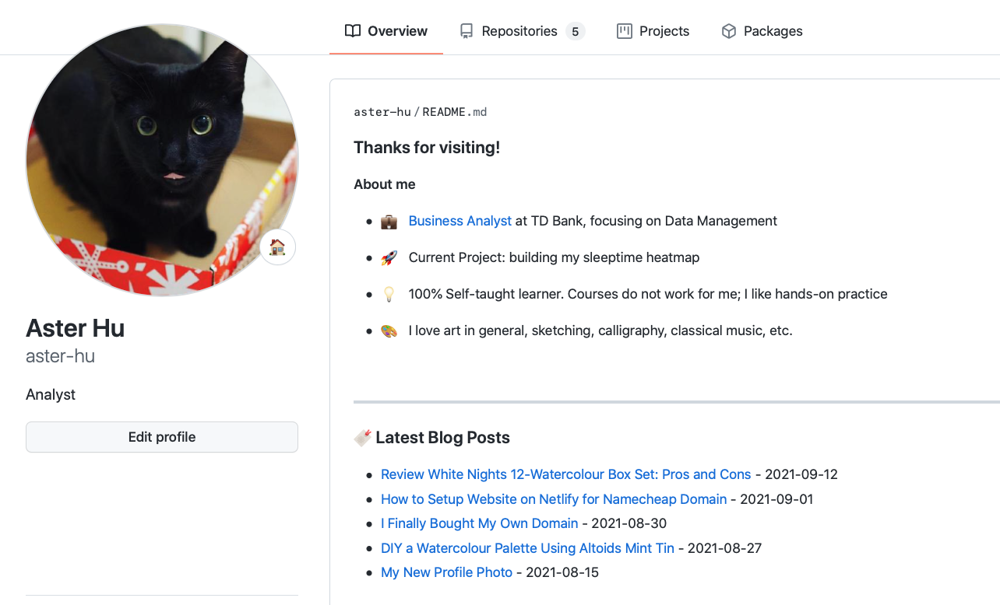
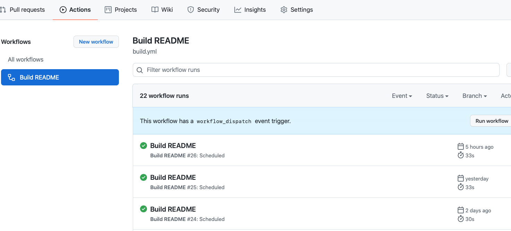

On my GitHub profile, I have an *About Me* session that includes my most recent blog posts. It is automatically updated by running GitHub Action in the back end. This post will show the steps to achieve the result.



## Github bonus: a dynamic portfolio/resume!

Github has an awesome feature<sup id="profile">[[1]](#reference)</sup> to show profile README at the top of your profile page. It can be used as resume, project showcase, or anything you would like to tell the world.

It can be easily done by creating a README.md in the special repository `/username/username/`, and all content of this README file will be presented on profile page. In my case, my repo is [https://github.com/aster-hu/aster-hu](https://github.com/aster-hu/aster-hu)

In my README file, I have a section for my 5 recent blog posts. I can manually update the content, of course, but what I want to achieve is to have the title and link automatically updated whenever I add a new post. It can be done by setting up a [GitHub Action](https://docs.github.com/en/actions/quickstart) workflow<sup id="githubaction">[[2]](#reference)</sup>.

The mechanism of GitHub Action is similar to Microsoft Power Automate — it is triggered by a specific event or time, and then perform a series of actions. In this case, I want the workflow to run a Python script daily that scrapes recent posts from my blog.

## How to #1: create Python script

The Python script is to scrape contents from my website. I used [Eugene Yan](https://github.com/eugeneyan/eugeneyan/)<sup id="script">[[3]](#reference)</sup>'s script and will explain a bit more in this section. The script `build_readme.py` can be viewed [here](https://github.com/aster-hu/aster-hu/blob/main/build_readme.py).

#### 1. Extract blog posts

Naturally, the first step is to extract the data I need from my blog. It is done by `feedparser` which retrieves post title, url and publish date from RSS feed of this site.

```python
import feedparser

# Fetch the latest 5 posts by feedparser
def fetch_writing():
    # replace the RSS address to your own
    entries = feedparser.parse('https://asterhu.com/feed.xml')['entries']
    top5_entries = entries[:5]
    entry_count = len(entries)
    return [
               {
                   'title': entry['title'],
                   'url': entry['link'].split('#')[0],
                   'published': re.findall(r'(.*?)T00:00', entry['published'])[0]
               }
               for entry in top5_entries
           ], entry_count
```

#### 2. Replace README

Next is to find where the data should go. This is done by searching keyword `Blogpost` in README. For example, below is my markdown README file. You can see the comment blocks of `<!-- Blogpost starts -->` and `<!-- Blogpost ends -->`.

```markdown
### 🔖 Latest Blog Posts
<!-- Blogpost starts -->
* [DIY a Watercolour Palette Using Altoids Mint Tin](https://asterhu.com/DIY-altoid-tin-watercolour-palette/) - 2021-08-27
* [My New Profile Photo](https://asterhu.com/palette-profile-photo/) - 2021-08-15
<!-- Blogpost ends -->
```

The below script will find the two keywords and replace the contents between them with new data.

```python
import pathlib
import re

root = pathlib.Path(__file__).parent.resolve()

# Find the search trigger in readme
# by searching for comment "Blogpost"
# e.g. "Blogpost starts" "Blogpost ends" in readme
# data will replace the text between the two words
def replace_writing(content, marker, chunk, inline=False):
    r = re.compile(
        r'<!\-\- {} starts \-\->.*<!\-\- {} ends \-\->'.format(marker, marker),
        re.DOTALL,
    )
    if not inline:
        chunk = '\n{}\n'.format(chunk)
    chunk = '<!-- {} starts -->{}<!-- {} ends -->'.format(marker, chunk, marker)
    return r.sub(chunk, content)
```

#### 3. Execute the code

The above steps have defined the function. Now we need to put it into execution, so that it can retrieve the data and rewrite the file.

```python
# Execution the code
if __name__ == '__main__':
    readme_path = root / 'README.md'
    readme = readme_path.open().read()
    entries, entry_count = fetch_writing()
    print(f'Recent 5: {entries}, Total count: {entry_count}')
    entries_md = '\n'.join(
        ['* [{title}]({url}) - {published}'.format(**entry) for entry in entries]
    )

    # Update entries
    rewritten_entries = replace_writing(readme, 'Blogpost', entries_md)
    readme_path.open('w').write(rewritten_entries)
```

## How to #2: set up workflow in GitHub Action

This step will create a GitHub Action workflow.

First we need to create `.github/workflows` directory (two folders) in the special repository. In this directory, create a file named `build.yml`. My yaml file can be viewed [here](https://github.com/aster-hu/aster-hu/blob/main/.github/workflows/build.yml) and I will explain each section as follows.

#### 1. Action trigger

As I mentioned before, this workflow will run daily, which is a time-based trigger. I set it to run every day at midnight by [cron](https://crontab.guru/), a standard command-line scheduler.

```yml
# Build.yml
name: Build README
on:
  push:
  workflow_dispatch:
  schedule:
    - cron:  '0 0 * * *' # run every day at midnight
jobs:
  build:
    runs-on: macos-latest
    steps:
    - name: Check out repo
    ...
    ...
```

Lines before `jobs` define the action trigger. The line `cron:  '0 0 * * *'` represents the specific time (midnight 0:00) for this scheduled workflow.

The cron schedule can be configured on [crontab site](https://crontab.guru/), which will translate the time expression to cron format. More examples can be viewed [here](https://crontab.guru/examples.html).

#### 2. Set up environment

A workflow consists of multiple actions. Each value in `name` category defines one action. Usually the first few actions is to set up the environment, such as selecting the python version, installing dependencies as below.

```yml
    # set up
    - name: Check out repo
      uses: actions/checkout@v2
    - name: Set up Python
      uses: actions/setup-python@v2
      with:
        python-version: 3.8
        architecture: x64
    - name: Install dependencies
      run: python -m pip install -r requirements.txt
```

Because I used `feedparser` in the Python script and it is not a build-in library in Python 3.8, I need to put it as dependencies. To do so, I created a `requirements.txt` in the repository and write `feedparser` in [this text file](https://github.com/aster-hu/aster-hu/blob/main/requirements.txt).

#### 3. Update content

The next action is to run our Python script `build_readme.py` and concatenate `README.md` file.

```yml
    # run python script and concatenate readme file
    - name: Update README
      run: |-
        python build_readme.py
        cat README.md
```

#### 4. Push changes to GitHub

At this point, the contents in README file has been updated on local repository. We still need to push the changes to GitHub to update the GitHub profile page. 

The following script detects changes update by `git diff`, and will commit and push only if there is any change.

The commit is pushed by Github Action bot, so credential is not needed.

```yml
    - name: Commit and push if changed
      run: |-
        git diff
        git config --global user.email "41898282+github-actions[bot]@users.noreply.github.com"
        git config --global user.name "github-actions-bot"
        git add -A
        git commit -m "Updated blogpost" || exit 0
        git push
```

## Check the outcome

The workflow has now been set up. Each time it runs, the status will be shown in `Actions` of this repository. 



It can also be triggered manually by clicking the workflow name `Build README` and select `Run workflow`, which is great for testing.

It is fairly easy and takes only few hours to set up everything, and the outcome saves lots of manual work in the future. I'm always interested in automated stuff, and it feels great to have a self-update GitHub profile.

## Reference

<sup>[[1]](#profile)</sup>GitHub Docs. *Managing your profile README*. [https://docs.github.com/en/account-and-profile/setting-up-and-managing-your-github-profile/customizing-your-profile/managing-your-profile-readme](https://docs.github.com/en/account-and-profile/setting-up-and-managing-your-github-profile/customizing-your-profile/managing-your-profile-readme)  
<sup>[[2]](#githubaction)</sup>GitHub Docs. *Quickstart for GitHub Actions*. [https://docs.github.com/en/actions/quickstart](https://docs.github.com/en/actions/quickstart)  
<sup>[[3]](#script)</sup>Eugeneyan. Eugeneyan's repository. [https://github.com/eugeneyan/eugeneyan](https://github.com/eugeneyan/eugeneyan/)