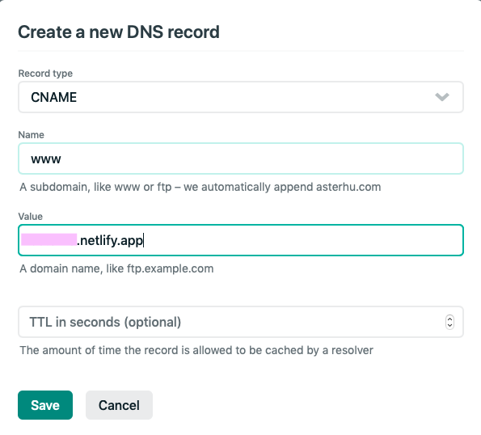
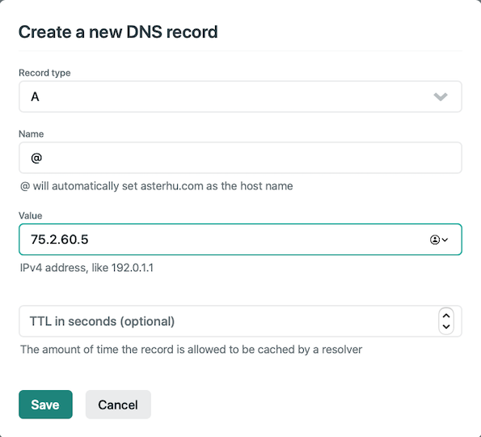
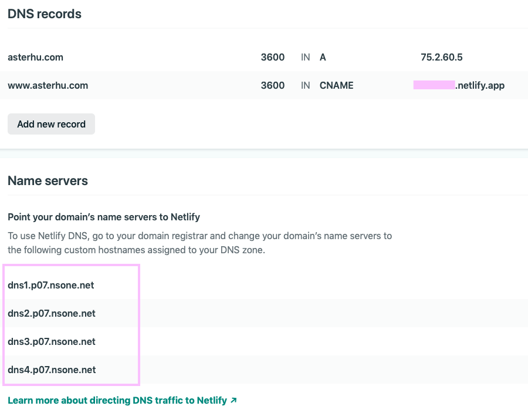

# Prerequisites

Think of it as starting a business. Buying a domain is like registering a company name. The Github repository is your goods and inventory. Web hosting is opening the storefront to the public to present all your products.

So you would need:

- A custom domain. I'm using a [Namecheap](http://namecheap.com/) domain as an example. It typically costs around $10~$20 and I wrote an article about [buying a domain](/custom-domain-for-personal-website).
- A Github repository that has website source files. I wrote about [my experience of creating a static website via Jekyll](/create-site-with-jekyll) before and it can direct you to the right resources.
- An account in [Netlify](https://www.netlify.com), the web hosting server

# Outcome

Let's get the expectation right.

- Namecheap is the domain registrar and has nothing to do with the content itself
- The GitHub repo of the website will be linked to Netlify
- The website will be built on Netlify and refreshed whenever you updated the git repository;
- The final goal is to link between your domain and your Netlify site

# I. Configure Netlify

## 1. Add site from Github repository

This step is relatively easy. Click "New Site from Git" button on the homepage and follow the screen guide. After it's completed, you will get a URL of your Netlify site in a format as `name-of-your-site.netlify.app`.

## 2. Add custom domain

To add a custom domain on Netlify, go to the site’s `Settings › Domain Management` section and enter your domain name.

## 3. Add DNS Records for custom domain

Under `Custom domains`, go to DNS panel › `Add a new record`

### Create a CNAME record

Record Type: `CNAME`  
Name: `www`  
Value: `name-of-your-site.netlify.app` (your netlify site address)  

### Create an A record

Record Type: `A`  
Name: `@`  
Value: `75.2.60.5` (Netlify’s IP address, [provided in Netlify Doc](https://docs.netlify.com/domains-https/custom-domains/configure-external-dns/))[[1]](#reference)

After creating the records, it should look like below. Keep this page open as we will need those values under `Name servers` later.

> *If You Would Like to Know Why...*

**Good to Know: Types of Domains[[2]](#reference)**

"Domain" is a general term for website address. There are different types:

**Apex domain**: also called root domain. It refers to the core part of a domain, such as `google.com`. Note that the `www` part does not count.

**Subdomain**: branch of the root domain. For example, `maps.google.com`. Note that `www.google.com` is also considered as a subdomain.

**Netlify subdomain**: it's a Netlify term for the site address assigned to the user, the format is `name-of-your-site.netlify.app`.

# II. Configure Namecheap

Go to Namecheap `homepage › Manage › Domain`, the default value for `Nameservers` should be `Namecheap BasicDNS`, change it to `Custom DNS`, and add nameservers provided by Netlify. In this case, there're four values.

Done. Be patient because it may take some time for DNS settings to propagate. After that, your personal website would be accessed by custom domain.

# Reference

[[1]](#dns)Netlify docs - [Configure external DNS for a custom domain](https://docs.netlify.com/domains-https/custom-domains/configure-external-dns/)

[[2]](#domain)Netlify docs - [Custom Domains](https://docs.netlify.com/domains-https/custom-domains/)