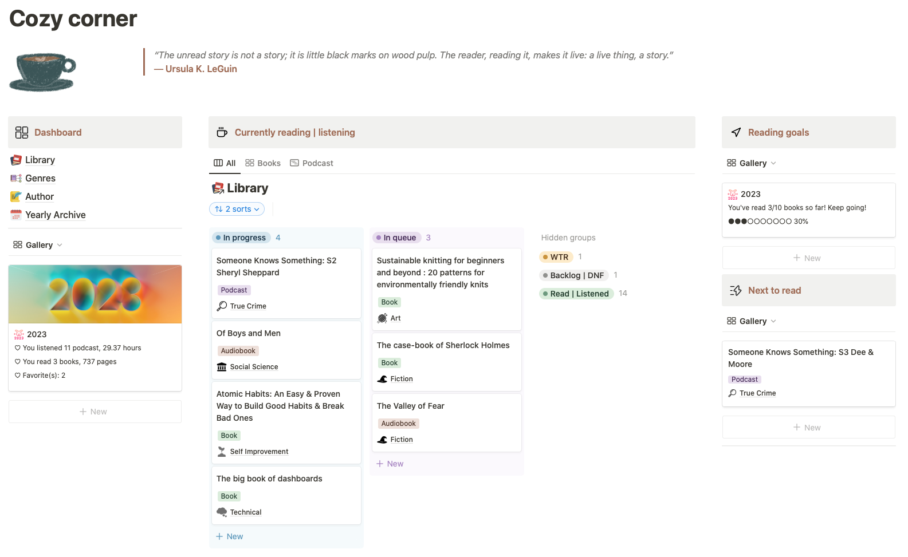

## New goal for the new year

I usually do not conduct annual reviews or set up goals during the new year because each day is equally important to me. For that reason, I rarely celebrate holidays. However, I recently discovered something interesting about podcasts and I think it's a good idea to add it as a listening challenge.

## Why podcast?

Podcasts are terrific medium to listen to during spare time. I used to listen to audiobooks when I knit, and now I listen to podcasts most of the time. I like the fact that I can multitask while listening to podcasts: knitting/podcast, cleaning/podcast, brushing teeth/podcast. The combinations are limitless.

## What podcasts to listen to?

Interest is the ultimate motivation. I mainly listen to true crime podcasts because I found cold cases fascinating. Find something that you really like, not what you want you to like.

The podcasts I'm currently listening to:

### News

[Front Burner](https://www.cbc.ca/listen/cbc-podcasts/209-front-burner): This is the only news podcast that I listened to because this type of podcast updates pretty frequently (usually everyday) and the topic is similar. The host Jayme Poisson is incredible - she asks meaningful questions without bias, and I like that she always asks the guest to provide background knowledge at the beginning of the episode so that the audience can understand the context even without any prior knowledge. The average length of each episode is 20~30 minutes.

### True crime

[The Next Call with David Ridgen](https://www.cbc.ca/listen/cbc-podcasts/1018-the-next-call): One of the best true crime podcasts in Canada. The tempo and pace is great, and it's the most straightforward/to-the-point true crime podcast. The investigation was conducted virtually via phone interview. The host, David Ridgen, is compassionate to victim families and has his ways to make people talk. The average length is about 50 minutes * 3 episodes for a case.

[Someone Knows Something](https://www.cbc.ca/listen/cbc-podcasts/128-someone-knows-something): Another excellent podcast series from David Ridgen. The difference is that the investigation of SKS was conducted on site, and there will be more contents of describing the scene, therefore it's much longer than The Next Call. The average length is about 40 minutes * 10 episodes for a case.

[Uncover](https://www.cbc.ca/listen/cbc-podcasts/187-uncover): The investigation approach is similar to SKS, however, Uncover is more focus on storytelling rather than investigation. It is more heavily edited.

[Missing & Murdered](https://www.cbc.ca/listen/cbc-podcasts/148-missing-murdered-finding-cleo): I’ve only listened to S1 so far and it's not very impressive. There were too many unnecessary fillers and anecdotes. It is especially annoying during the mid-later stage of the investigation, where there's just too much time spent listening to the host waiting to approach someone. The presentation can definitely be better.

**Update**: Season 2 is incredible! The presentation is so much better than S1. It is an exceptional case that covered lots of horrific and sad stories during the Sixties Scoop in Canadian history.

### History

[The Secret Life of Canada](https://www.cbc.ca/listen/cbc-podcasts/203-the-secret-life-of-canada): It is a very interesting podcast that tells interesting things about Canada, mostly related to history or social culture. I found it relatable because I'm a new Canadian. There're many other podcasts that serve educational purposes such as Science Friday or Stuff You Should Know, but I can't keep up my interest and eventually unsubscribe them.

## What app and how to track progress

Initially I use Apple Podcast. It's simple and does the job, but soon I found that I needed something more complicated.

Thanks to r/podcast, I'm currently using [RSS Radio](https://apps.apple.com/ca/app/podcast-player-rssradio/id386600664). It's free and has tons of features, including almost everything you would ask for in a podcast app - customized skip setting, voice booster, etc.

I also wanted a place to review and track the podcasts I listened to. Unfortunately, there is no general review site such as Goodreads for podcasts. The closest options I found are [Listen Notes](https://www.listennotes.com) and [Podchaser](https://www.podchaser.com), however the former is more like a database and does not have a rating system, while the latter does not allow me to review multiple episodes at once.

I ended up building a notion database to track what I read and listen. It looks like this and I'm quite happy about it:

Now it's the time to set a goal. I've seen people set 100 books as a reading challenge, but I think that’s too much for podcasts. Because true crime is the main genre I listened to, the way I calculated it in Notion is based on each case instead of episode, which would require too much logging effort.

So, I think 50 podcasts/cases would probably be a realistic number to start with, since I just started this habit.

Anyways, happy new year and happy listening!